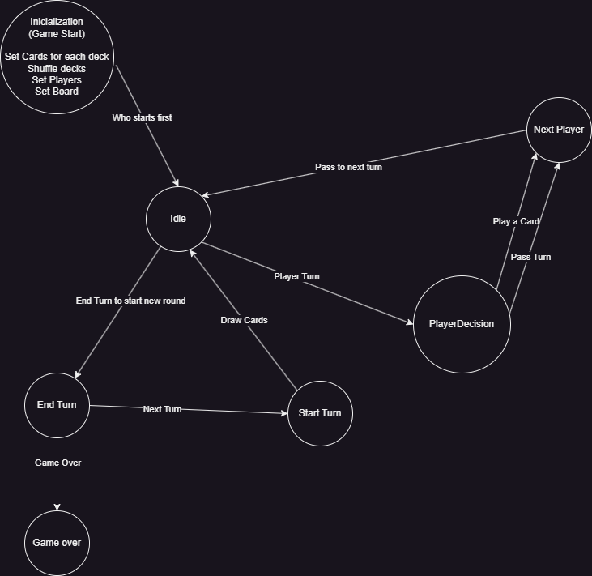

# Gwen't

This work is licensed under a
[Creative Commons Attribution 4.0 International License](http://creativecommons.org/licenses/by/4.0/)

Context
-------

This project's goal is to create a (simplified) clone of the
[_Gwent_](https://www.playgwent.com/en) card game developed by [_CD PROJEKT RED_](https://cdprojektred.com/en/)

---

**The rest of the documentation is left for the users of this template to complete**

# Descripción

---
El proyecto a realizar será crear un clon (simplificado) del juego de cartas _Gwent_ desarrollado por _CD Projekt RED_.
A grandes rasgos el juego tendrá dos jugadores, uno controlado por el usuario y otro controlado por la computadora.
Cada jugador tendrá un mazo y una mano de cartas que puede jugar en un tablero en una partida al mejor de tres
rondas.

# Tarea 1

---

Para la entrega parcial 1, empecé realizando los distintos tests para los elementos básicos del juego: Jugador y Carta
Creando las distintas variables usadas en la clase player, como el nombre, su posición, las gemas(vidas), cartas en
el mazo y las cartas en su mano.
Además se crearon 2 funciones principales a la hora del juego, la primera de sacar carta de un mazo, donde se remueven
las cartas del mazo y se agregan a la mano. La otra función descuenta las cartas de una mano cuando son jugadas.

# Tarea 2

---

En la entrega final 2, se crearon 2 clases nuevas, la clase Board y WeatherZone. En esta clase Board, se crearon
distintas variables que representan las distintas zonas del tablero. En donde en cada una de ellas se puede jugar una
carta, mostrar su contenido y usar los setters para dejar una zona con contenido predeterminado. Aquí la excepción de
estas variables es la Zona Clima, la cual se inicializa como una zonaWeather con la misma memoria usando getInsance
(Materia vista en clases), asi sin importar el numero de tableros la zona clima siempre será la misma. Para poder
usar las funciones como cualquier otra zona, se hace una función que llama a otra función dentro de la clase
WeatherZone, esto solamente para mantener la consistencia al usar las funciones. Asi todas las funciones que afectan a
las distintas zonas sean iguales.

var board1 = new Board()

var board2 = new Board()

board1.getWeatherZone == board2.getWeatherZone

board1.getSiegeCombatZone != board2.getSiegeCombatZone

Ahora cómo fue posible hacer que un jugador pueda jugar una carta, primero se crearon las funciones
removeFromHand que remueve una carta específica de la mano, y este es usado en la segunda función para jugar una carta.
Esta segunda función llama a removeFromHand para remover la carta, en el caso de que esa carta no existe o no este en
la mano, no se realiza la acción. Y luego llama a una segunda función playOnBoard, que recibe como parámetros el board
y la carta que escogimos. La función playOnBoard es implementada en todas las clases cartas, y dependiendo del tipo de
board/zona, se usa una función playOnBoard. Cuando esté en su función correcta esta llama a la última función, en
la clase board la cual termina agregando la carta jugada en su respectiva zona. Toda esta parte es lo que 
consideraríamos Double Dispatch.

## Diagrama de estados

---

## Entrega Parcial 5 - Tarea 3

---

Para esta entrega, se hicieron los distintos tipos de efectos, en mi caso cree 2 clases abstractas para cada tipo de 
efecto, como no usan las mismas funciones. Por ahora no hice lo especifico de cada clase por no tener tiempo suficiente.

## Entrega Parcial 6 - Tarea 3

---

Se terminaron todas las funciones de los efectos además de utilizar el Observer pattern para alertar/notificar al Game 
Controller el momento que un jugador baje su vida a 0, este determina el perdedor. 

# Tarea 3

---

En la entrega final 3, se crearon los distintos estados de juego al que se puede llegar, agregar los efectos de las
cartas clima y unidad, y modificar como estos efectos actúan entre ellas. Para el último punto, se crearon 2 variables
nuevas que representan los poderes originales y el poder después de ser afectada por un efecto. Así al momento de
usar primero una carta unidad con un efecto como Refuerzo Moral, las unidades de su zona en particular tendrían un poder
"Poder + 1" pero al momento de usar una carta clima que afecte a esa zona y cambie su poder a 1, y luego con el efecto
Clima Despejado cambiaría los poderes a como estaba antes, osea "Poder + 1". Además se agregaron los observadores para
notificar al momento que un usuario tenga 0 vidas o menos.